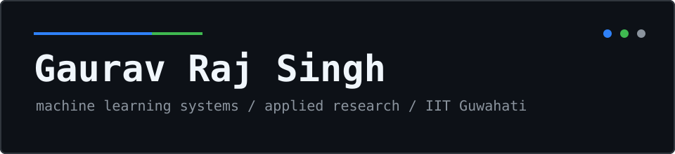
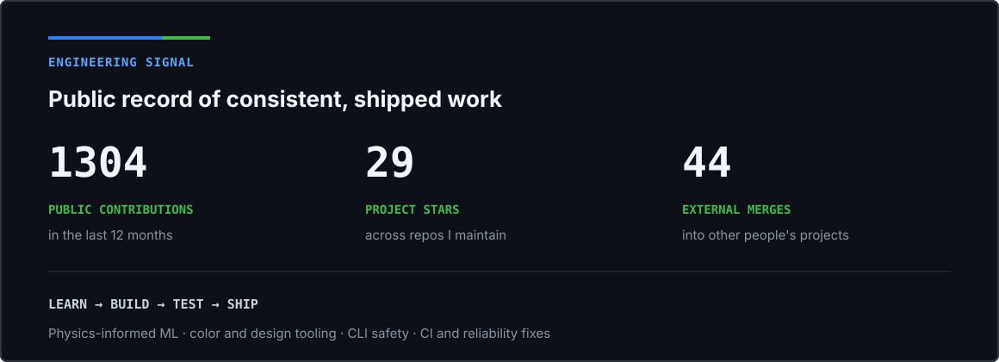
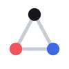

  

  

    
    
    
  

Hi, I'm Gaurav. I'm an undergraduate at IIT Guwahati, and I build machine learning systems and the software around them. Most of what's below is public: physics-informed models, small tools I ship for myself, and the occasional pull request into someone else's project when I run into something worth fixing.

  
   
  <!--metrics-caption-->Last updated 26 Aug 2026, 00:39:47 (timezone Asia/Kolkata) with lowlighter/metrics@3.34.0<!--/metrics-caption-->

## Proof of work

  

## Projects

<!-- Add a row per project: |  Name | [Showcase](LINK) | Area | -->

| Project | Showcase | Area |
| --- | --- | --- |
|  Hueclid | [hueclid.cinexg.com](https://hueclid.cinexg.com) | Accessible color palette generation from screenshots (K-means + neural net) |
|  Groundline | [github.com/gauravxsuvo/groundline](https://github.com/gauravxsuvo/groundline) | Voice-enabled RAG with benchmarked retrieval and verified grounding (Python, FAISS) |

## Selected contributions

| Project | Merged contribution | Area |
| --- | --- | --- |
| [OneAM-Labs / dam](https://github.com/OneAM-Labs/dam) | [Make flowinto apply the target stream's latest seal](https://github.com/OneAM-Labs/dam/pull/43) | Data integrity in a Rust CLI |
| [OneAM-Labs / dam](https://github.com/OneAM-Labs/dam) | [Warn before dam apply overwrites files with unsealed local changes](https://github.com/OneAM-Labs/dam/pull/26) | Safety guardrails for a CLI tool |
| [OneAM-Labs / dam](https://github.com/OneAM-Labs/dam) | [Add a CI workflow to build and test on push and PR](https://github.com/OneAM-Labs/dam/pull/14) | CI setup |
| [suraj1074 / finAgent](https://github.com/suraj1074/finAgent) | [Specify explicit UTF-8 encoding for all text file handling](https://github.com/suraj1074/finAgent/pull/46) | Cross-platform reliability fix |

## Articles

| Article | Topic |
| --- | --- |
| [We rebuilt the front door to hueclid.](https://www.linkedin.com/pulse/we-rebuilt-front-door-hueclid-gaurav-raj-singh-0ncvc/) | Rebuilding the Hueclid landing page |
| [Your palette looks great. Can people actually read it?](https://www.linkedin.com/pulse/your-palette-looks-great-can-people-actually-read-gaurav-raj-singh-bbl2c/) | Contrast and readability in generated palettes |
| [From cinexg-eda to statlens.](https://www.linkedin.com/pulse/from-cinexg-eda-statlens-gaurav-raj-singh-w8ccc/) | Turning an EDA tool into Statlens |
| [Why I Started Looking at Colors as Vectors Instead of Just Colors.](https://www.linkedin.com/pulse/why-i-started-looking-colors-vectors-instead-just-gaurav-raj-singh-johfc/) | Perceptual color spaces and Oklab |
| [I built a neural network that enforces Darcy's law to find unreported groundwater pumping.](https://www.linkedin.com/pulse/training-loss-said-fine-holdout-wells-394-gaurav-raj-singh-pxzqc/) | Physics-informed ML for groundwater monitoring |
